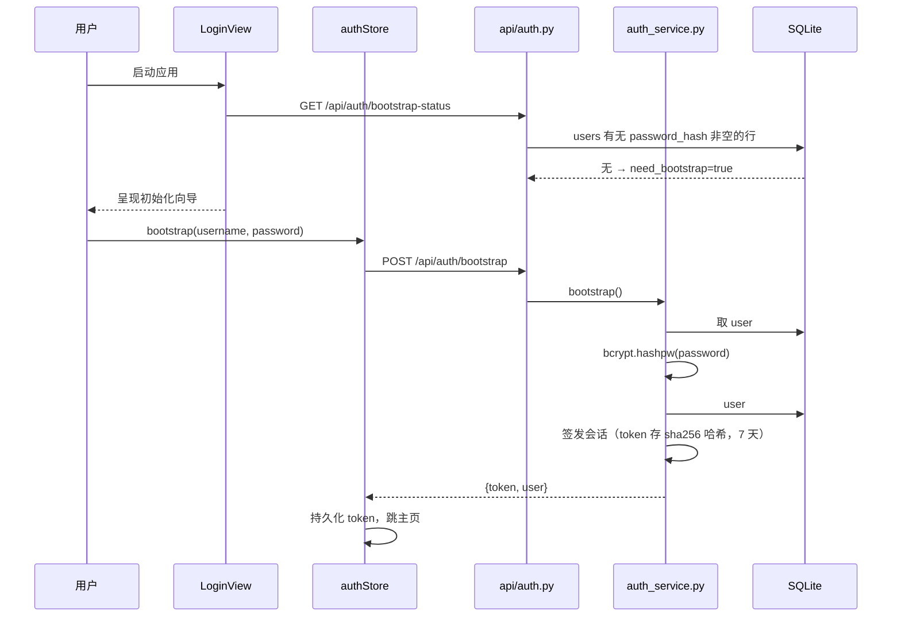
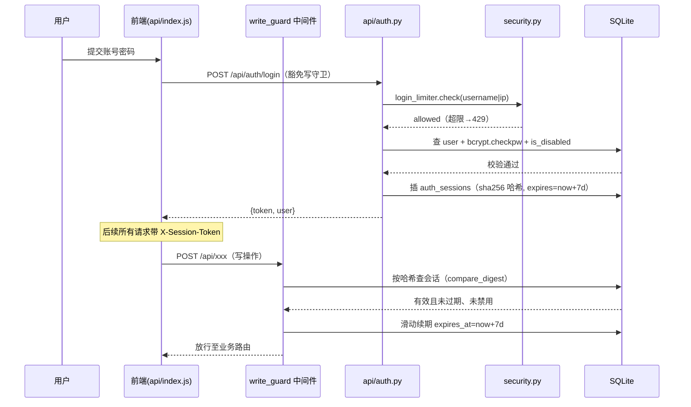
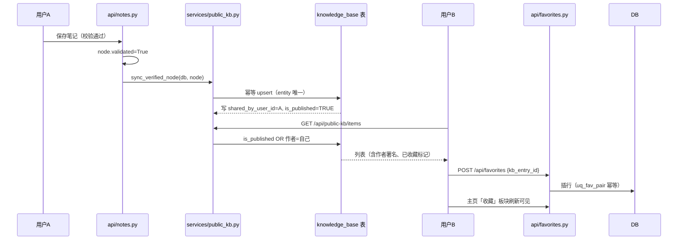
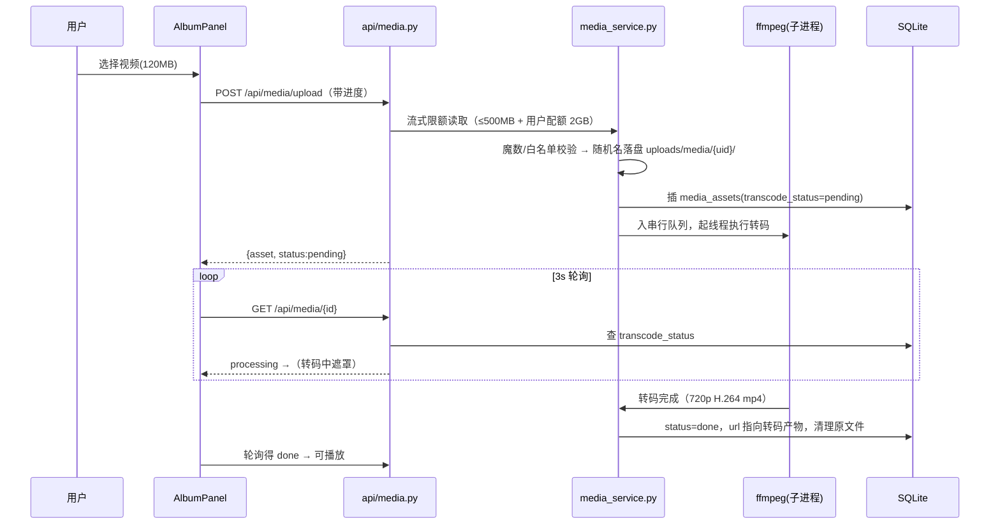
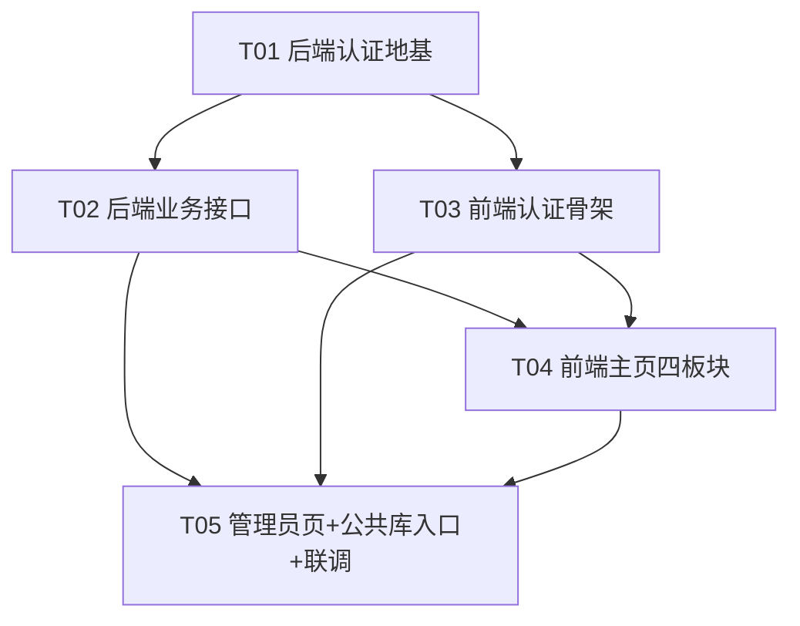

# 系统架构设计：用户认证 + 公共知识库 + 哔哩哔哩式个人主页

> 对应 PRD：`docs/prd/prd-auth-publickb-homepage.md`（需求池 R1–R15）
> 作者：架构师 Bob（高见远） · 状态：待工程师实现
> 原则：**最小变更**——在现有骨架上原地升级，不推倒重写；schema 变更一律走 `_COLUMN_MIGRATIONS`。

---

## 0. 现状判断（读码结论，设计的出发点）

| 现状 | 结论对设计的影响 |
|---|---|
| `users` 表已存在但只有 `username`；`user_profiles` 已有昵称/头像/背景 | 认证在 `users` 上**补列**（密码哈希/角色/禁用），不建新用户表 |
| `seed.ensure_default_user` 固定造 `user#1 default`，全库数据 `user_id=1` | 初始化向导**直接把 user#1 升级为首个管理员**（改名+写哈希+授角色），旧数据零迁移成本 |
| `write_guard` 中间件 + `ADMIN_TOKEN` 明文口令保护全部写操作 | 改造为「写操作需登录会话」，`/api/admin/*` 需管理员会话；口令机制整体下线 |
| `services/security.py` 有 fail-closed 校验、`hmac.compare_digest`、`_SlidingLimiter` | 令牌校验与登录限流**复用同一原语**，不另起炉灶 |
| `KnowledgeBase` 是全局表（无 user_id），候选 accepted 后 `_ingest_to_kb` 已写入 | 公共知识库**复用该表**补列（署名/下架），不新建公共库表 |
| `notes.py` 保存校验通过时置 `node.validated=True` | 这是「已验证知识点」的**同步触发点之一**，挂接公共库同步 |
| ProfileView 已有资料/头像/背景/素材库；AdminView 是 el-tabs 五页签 | 主页四板块以 ProfileView 为基底原地升级；AdminView 追加三个页签 |
| 前端 `api/index.js` 自动带 `X-Admin-Token` + 写死 `user_id=1` | 拦截器改造为带会话令牌、user_id 取自 authStore |

---

## 1. 实现方案 + 技术选型

### 1.1 认证方案（R1/R3/R4）

- **密码哈希：bcrypt**（pip 包 `bcrypt`，有 Windows 预编译 wheel，Electron 本地场景零编译负担；PRD 指定 bcrypt/argon2 二选一，bcrypt 依赖更小）。不引入 passlib（封装层在 bcrypt≥4.1 上有兼容包袱，直接用 `bcrypt.hashpw/checkpw`）。
- **会话令牌：不透明令牌 + 服务端会话表**（不用 JWT）。理由：本地应用、需要「禁用用户即时踢出」「登出即失效」「7 天滑动过期」，JWT 无状态反而要做黑名单，得不偿失。
  - 令牌格式：`kgt_` + `secrets.token_urlsafe(32)`；请求头 `X-Session-Token`。
  - 库中**只存 SHA-256 哈希**，比较用 `hmac.compare_digest`（沿用 fail-closed 原语）。
  - 滑动过期：每次鉴权命中时 `expires_at = now + 7d`（本地单机写放大可忽略）；`last_seen_at` 同步更新。
  - 不限制多端：同一用户可有多条有效会话；登出只吊销当前会话。
- **登录失败限流**：`login_limiter = _SlidingLimiter(max_events=10, window_s=300)`，限流键 = `username|client_ip`（沿用 `client_key`，**不信任 X-Forwarded-For**）。超限 429 + Retry-After。
- **首个管理员：初始化向导**。`users` 表无有效账号（或 user#1 无密码哈希）时，系统处于 `need_bootstrap` 态：前端只呈现向导页，后端只放行 `bootstrap-status` 与 `bootstrap` 两个接口。bootstrap 动作 = 把 user#1 的 `default` 行升级为管理员（改 username、写 password_hash、role=admin），**旧数据外键天然归属，无需搬数据**。
- **移除明文 ADMIN_TOKEN（R2）**：`config.py` 删 `ADMIN_TOKEN`；`security.py` 删 `verify_admin_token/admin_token_configured`；`write_guard` 改造；前端 `api/index.js` 删 `X-Admin-Token` 全链路（含 `_promptAdminToken` 弹口令逻辑）；`AdminView` 删口令输入卡。工程师需全库搜索 `ADMIN_TOKEN` / `X-Admin-Token` / `kg-admin` 确认零残留（含 `backend/.env`、`check.py`、文档）。

### 1.2 鉴权中间件（R4）

`write_guard` 语义升级（仍是集中判定、默认拒绝）：

- 豁免清单新增：`POST /api/auth/login`、`POST /api/auth/register`、`POST /api/auth/bootstrap`、`GET /api/auth/bootstrap-status`（登录前必须可达）；保留 `POST /api/system/client-error`（崩溃时用户可能未登录）。
- 前缀豁免保留 `/api/admin/`——但 `admin.py` 内部 `require_admin` 改为「有效会话 + role=admin」，未登录 401、非管理员 403，强度不降。
- 其余写操作：校验 `X-Session-Token` → 有效且未过期、用户未禁用 → 放行并把 `user_id` 写入 `request.state`；否则 401。
- 提供 FastAPI 依赖 `require_user` / `require_admin`（放 `services/auth_service.py`），各新接口用依赖注入取当前用户，**禁止再从 query 裸传 user_id 当身份依据**（过渡期旧接口保留 user_id 参数兼容，但由中间件校验会话后覆盖为会话用户）。

### 1.3 公共知识库（R5/R13）

- 复用全局 `KnowledgeBase` 表，补三列：`shared_by_user_id`（署名，NULL=系统/种子条目）、`is_published`（默认 TRUE，下架开关）、`shared_at`。
- **同步触发点**（统一走新服务 `services/public_kb.py::sync_verified_node(db, node)`，幂等）：
  1. `notes.py` 笔记校验通过 → `node.validated=True` 时同步该节点；
  2. 候选知识点 accepted → `_ingest_to_kb` 已写库，补写 `shared_by_user_id` 署名；
  3. 「取消分享」：作者调 `POST /api/public-kb/items/{id}/unshare` → `is_published=False`（条目保留，作者本人仍可见）。
- 可见性规则：`is_published=TRUE OR shared_by_user_id=当前用户`；管理员下架同样置 `is_published=FALSE`，可由管理员恢复。种子条目（`source in seed_corpus/builtin`）`shared_by_user_id=NULL`，恒可见、不参与署名与取消分享。

### 1.4 收藏（R6/R15）

新表 `favorites(user_id, kb_entry_id, group_name, created_at)`，唯一约束 `(user_id, kb_entry_id)`。`group_name` 列本期落库但 UI 只做简单筛选（R15 P2 预留，不再返工改表）。收藏=插行，取消=删行，列表按时间倒序。

### 1.5 日记（R8）

新表 `diaries(user_id, title, content_md, created_at, updated_at)`，Markdown 格式，仅本人可见（查询强制 `user_id=会话用户`），倒序分页（`clamp_paging`）。
前端渲染：`marked` 转 HTML + `dompurify` 消毒后才能进 `v-html`（**不可信内容先消毒**，这是硬约束）。

### 1.6 相册 + 视频转码（R9/R10）

- 新表 `media_assets(user_id, kind, url, size_bytes, duration_s, transcode_status, transcode_error, created_at)`。
- 上传：`POST /api/media/upload`，**流式限额读取**（单文件 ≤500MB，配置 `MAX_MEDIA_MB`；每用户配额 2GB，`MEDIA_QUOTA_MB`，超限 413）；图片沿用魔数校验（jpg/png/gif/webp），视频按魔数/扩展名白名单（mp4/webm/mov/avi/mkv）；文件名随机化，落 `uploads/media/{user_id}/`，静态服务沿用 `/uploads` 挂载。
- **ffmpeg 引入方式：subprocess 直调系统二进制**（不引入 pip 封装库——`ffmpeg-python` 也只是 subprocess 包装）。探测顺序：`FFMPEG_PATH` 配置 → `PATH`（`shutil.which`）→ 常见安装目录；探测失败则转码功能降级为「原样存放 + 标注不支持在线播放」，图片相册不受影响。`check.py` 体检加 ffmpeg 一项。
- 转码阈值与规格（用户已拍板）：>50MB 触发，输出 720p H.264 mp4（`-vf scale=-2:720 -c:v libx264 -preset veryfast -crf 23 -c:a aac`）；时长/缩略图用同机 `ffprobe` 与抓帧。
- **异步模型**：进程内 `ThreadPoolExecutor(max_workers=1)` 串行队列（本地应用，避免多转码抢 CPU），状态机 `pending → processing → done | failed` 写回 `media_assets`；前端卡片显示「转码中」遮罩并轮询 `GET /api/media/{id}`（3s 间隔，页面卸载停轮询）。

### 1.7 哔哩哔哩式个人主页（R7/R14）

- 新组件 `HomeView.vue`：封面横幅（沿用 `user_profiles.background_url` + `background_config`）+ 头像信息条（头像/昵称/签名/注册时间/统计：日记 n·收藏 n·相册 n）+ 板块 Tab（日记 / 知识图谱 / 收藏 / 个人相册）。
- 现有 ProfileView 的资料编辑、头像、背景与素材库功能**迁入主页「编辑资料」抽屉**（组件原地改造，不删文件，R14 旧数据零丢失）。
- `App.vue` 的 `NAV_TABS` 主页提为第一项且默认落地；「图谱入口」板块点击调 `activate('graph')`。
- 未登录时全应用只渲染 `LoginView`（登录/注册 Tab + 管理员入口 + 初始化向导三态）。

### 1.8 管理员页（R11/R12/R13）

AdminView 追加三个页签：「数据存储管理」（DB 文件大小、uploads 目录占用、用户/知识点/收藏/日记/媒体计数、每用户明细，接口 `GET /api/admin/storage`，sqlite 读文件大小、PG 读 `pg_database_size`）、「用户管理」（列表 + 禁用/启用，禁用即吊销该用户全部会话）、「公共库内容管理」（下架/恢复）。口令输入卡删除，进入 AdminView 的前提是管理员会话。

### 1.9 架构模式

沿用现有分层：`api/`（路由+参数守卫）→ `services/`（业务）→ `models/`（SQLAlchemy）；前端 Vue3 + Pinia（新增 `authStore`、`homeStore`），视图组件懒加载不变。

---

## 2. 文件列表（new / modify）

### 后端 `backend/`

| 路径 | 状态 | 说明 |
|---|---|---|
| `requirements.txt` | modify | +bcrypt |
| `app/config.py` | modify | 删 ADMIN_TOKEN；+SESSION_TTL_DAYS=7、MAX_MEDIA_MB=500、MEDIA_QUOTA_MB=2048、VIDEO_TRANSCODE_MB=50、FFMPEG_PATH |
| `app/models/models.py` | modify | users 补列；KnowledgeBase 补列；新增 AuthSession/Diary/Favorite/MediaAsset |
| `app/database.py` | modify | `_COLUMN_MIGRATIONS` 追加 users/knowledge_base 补列 |
| `app/services/security.py` | modify | 删口令校验；+token 生成/哈希/恒定时间比较、login_limiter |
| `app/services/auth_service.py` | **new** | 注册/登录/登出/会话签发与滑动续期/bootstrap/require_user/require_admin |
| `app/services/public_kb.py` | **new** | 已验证→公共库幂等同步、取消分享、可见性查询 |
| `app/services/media_service.py` | **new** | 媒体上传限额/魔数/配额、ffmpeg 探测、转码队列与状态机 |
| `app/api/auth.py` | **new** | `/api/auth/*` 六个接口 |
| `app/api/diary.py` | **new** | 日记 CRUD |
| `app/api/favorites.py` | **new** | 收藏/取消/列表 |
| `app/api/public_kb.py` | **new** | 公共库浏览 + 取消分享 |
| `app/api/media.py` | **new** | 相册上传/列表/删除/转码状态 |
| `app/api/admin.py` | modify | require_admin 改会话制；+storage、用户禁用/启用、公共库下架/恢复 |
| `app/api/notes.py` | modify | 校验通过触发 public_kb 同步 |
| `app/services/knowledge_verifier.py` | modify | `_ingest_to_kb` 补署名 |
| `app/api/profile.py` | modify | user_id 改由会话解析（签名兼容） |
| `app/main.py` | modify | write_guard 改造 + 注册新路由 |
| `app/seed.py` | modify | ensure_default_user 幂等语义不变（bootstrap 在其上升格） |
| `scripts/check.py` | modify | +ffmpeg 探测、新表列漂移检查 |
| `.env` | modify | 删 ADMIN_TOKEN，加新配置项（含注释） |

### 前端 `kg-vue3/src/`

| 路径 | 状态 | 说明 |
|---|---|---|
| `package.json` | modify | +marked、+dompurify |
| `src/store/authStore.js` | **new** | token/user/isAdmin，登录/登出/会话恢复，localStorage 持久化 |
| `src/store/homeStore.js` | **new** | 日记/收藏/相册数据与动作 |
| `src/api/index.js` | modify | 拦截器改 X-Session-Token；删 ADMIN_TOKEN 全链路；user_id 取自 authStore；401→跳登录 |
| `src/components/LoginView.vue` | **new** | 登录/注册 Tab + 初始化向导 + 管理员入口 |
| `src/components/HomeView.vue` | **new** | 封面+头像条+四板块 Tab |
| `src/components/home/DiaryPanel.vue` | **new** | 日记卡片流 + Markdown 编辑/预览 |
| `src/components/home/FavoritesPanel.vue` | **new** | 收藏列表 + 取消收藏 + 空态引导 |
| `src/components/home/AlbumPanel.vue` | **new** | 图片网格 + 视频卡片（转码遮罩/轮询）+ 上传进度 |
| `src/components/home/GraphEntryCard.vue` | **new** | 图谱入口大卡（统计 + 跳转） |
| `src/components/ProfileView.vue` | modify | 功能迁入主页「编辑资料」抽屉（原地改造） |
| `src/components/AdminView.vue` | modify | 删口令卡；+数据存储管理/用户管理/公共库内容管理三页签 |
| `src/components/KnowledgeBaseView.vue` | modify | 公共库浏览模式 + 条目收藏按钮 |
| `src/App.vue` | modify | 登录门控、NAV_TABS 主页第一、admin 页签按角色显隐 |
| `src/main.js` | modify | 启动时恢复会话 |
| `src/styles/main.css` | modify | 主页/登录页样式（只消费既有令牌） |

---

## 3. 数据结构与接口

### 3.1 表结构（新表 + 补列）

```python
# users 补列（_COLUMN_MIGRATIONS）
password_hash  VARCHAR(255)            # bcrypt，NULL=未初始化（旧 default 行）
role           VARCHAR(20) DEFAULT 'user'      # user | admin
is_disabled    BOOLEAN DEFAULT FALSE

# knowledge_base 补列
shared_by_user_id INTEGER              # 署名；NULL=系统/种子条目
is_published      BOOLEAN DEFAULT TRUE # 下架/取消分享=FALSE
shared_at         DATETIME

class AuthSession(Base):               # 新表
    __tablename__ = "auth_sessions"
    id, user_id(FK users.id), token_hash(String(64) unique),
    created_at, expires_at, last_seen_at, revoked(Boolean default False)
    Index("idx_session_user", "user_id")

class Diary(Base):                     # 新表
    __tablename__ = "diaries"
    id, user_id(FK), title(String(200)), content_md(Text),
    created_at, updated_at
    Index("idx_diary_user_time", "user_id", "created_at")

class Favorite(Base):                  # 新表
    __tablename__ = "favorites"
    id, user_id(FK), kb_entry_id(FK knowledge_base.id),
    group_name(String(50) default ""), created_at
    UniqueConstraint("user_id", "kb_entry_id", name="uq_fav_pair")

class MediaAsset(Base):                # 新表
    __tablename__ = "media_assets"
    id, user_id(FK), kind(String(10)),            # image | video
    url(String(500)), size_bytes(Integer), duration_s(Float),
    transcode_status(String(15) default "none"),  # none|pending|processing|done|failed
    transcode_error(String(300)), created_at
    Index("idx_media_user", "user_id")
```

删除用户时子表清理顺序：`auth_sessions → diaries → favorites → media_assets → （既有 files/nodes/notes 级联）`，`PRAGMA foreign_keys=ON` 已开。

### 3.2 关键 API 契约

统一错误体沿用 `{ok:false, error:{code,message,hint,request_id}}`；成功体 `{ok:true, ...}`。

**`/api/auth`**
| 方法/路径 | 说明 | 出参 |
|---|---|---|
| GET `/bootstrap-status` | 是否需要初始化向导 | `{need_bootstrap}` |
| POST `/bootstrap` `{username,password,display_name?}` | 创建首个管理员并承接旧数据 | `{token,user}` |
| POST `/register` `{username,password}` | 注册（管理员可后台禁用注册：配置 `REGISTRATION_OPEN`） | `{token,user}` |
| POST `/login` `{username,password}` | 登录（限流 10次/5min） | `{token,user}` |
| POST `/logout` | 吊销当前会话 | `{ok}` |
| GET `/me` | 会话恢复/探测 | `{user}` |

`user = {id, username, display_name, role, avatar_url, created_at}`；任何接口**不回显 password_hash**。

**业务接口**（全部需会话；user_id 一律取会话用户）
| 接口 | 说明 |
|---|---|
| GET/POST `/api/diary`，PUT/DELETE `/api/diary/{id}` | 日记 CRUD，倒序分页 |
| GET `/api/public-kb/items?keyword&domain&limit&offset` | 公共库（含作者署名、我是否已收藏） |
| POST `/api/public-kb/items/{id}/unshare` | 作者取消分享 |
| GET/POST `/api/favorites`，DELETE `/api/favorites/{kb_entry_id}` | 收藏 |
| POST `/api/media/upload`（multipart）、GET `/api/media`、GET `/api/media/{id}`、DELETE `/api/media/{id}` | 相册；`{id}` 返回转码状态供轮询 |
| GET `/api/admin/storage` | DB 大小/媒体占用/各表计数/每用户明细 |
| POST `/api/admin/users/{id}/disable` \| `/enable` | 禁用即吊销全部会话 |
| GET `/api/admin/public-kb`、POST `/api/admin/public-kb/{id}/takedown` \| `/restore` | 内容管理 |

### 3.3 前端 Store

```js
// authStore（pinia，persist localStorage）
state: { token, user, bootstrapped }
getters: { isLoggedIn, isAdmin }
actions: { bootstrapStatus(), bootstrap(), register(), login(), logout(), restore() /* GET /me */ }

// homeStore
state: { diaries, favorites, media, stats, loading, loadErrors /* allSettled 收集，失败不渲染假0 */ }
actions: { loadDiaries(), saveDiary(), removeDiary(), loadFavorites(), toggleFavorite(),
           loadMedia(), uploadMedia(file, onProgress), removeMedia(), pollTranscode(id) }
```

---

## 4. 程序调用流程（Mermaid）

### 4.1 初始化向导 → 首个管理员



### 4.2 登录 / 鉴权（含限流与滑动续期）



### 4.3 已验证知识点 → 公共库 → 收藏



### 4.4 相册上传 → 大视频异步转码



---

## 5. 依赖包列表

**后端 pip（`backend/requirements.txt`）**
```
+ bcrypt==4.1.2        # 新增：密码哈希（Windows 有预编译 wheel）
  fastapi / uvicorn / sqlalchemy / python-multipart / loguru / pydantic ...  # 均已存在，不动
```
- **ffmpeg**：非 pip 包，系统二进制。毕设交付方案：检测本机 + 引导文档（检测不到时转码功能降级、相册其余功能不受影响）；如后续要随 Electron 打包再评估 ffmpeg-static。

**前端 npm（`kg-vue3/package.json`）**
```
+ marked@^12.0.0       # 新增：日记 Markdown 渲染
+ dompurify@^3.0.0     # 新增：v-html 前消毒（硬约束：不可信内容先转义）
  vue / pinia / element-plus / axios / @vueuse/core ...  # 均已存在，不动
```

---

## 6. 任务列表（有序、含依赖）

> 分组原则：按层次，T01 是认证地基，其余尽量只依赖 T01。

| 编号 | 任务 | 涉及文件（相对路径） | 依赖 | 优先级 | 复杂度 |
|---|---|---|---|---|---|
| **T01** | 后端认证与会话地基：users/KnowledgeBase 补列 + 四张新表 + 迁移、auth_service/security 改造、/api/auth 六接口、write_guard 会话化、admin.require_admin 会话化、移除 ADMIN_TOKEN、config/.env/requirements | `backend/requirements.txt`、`backend/app/config.py`、`backend/app/models/models.py`、`backend/app/database.py`、`backend/app/services/security.py`、`backend/app/services/auth_service.py`(new)、`backend/app/api/auth.py`(new)、`backend/app/main.py`、`backend/app/api/admin.py`（仅 require_admin 部分）、`backend/app/seed.py`、`backend/.env` | 无 | P0 | 高 |
| **T02** | 后端业务接口：公共库同步与署名、日记/收藏/公共库/相册+ffmpeg 转码、admin 三板块（storage/用户禁用/内容下架）、notes 触发点接入 | `backend/app/services/public_kb.py`(new)、`backend/app/services/media_service.py`(new)、`backend/app/api/diary.py`(new)、`backend/app/api/favorites.py`(new)、`backend/app/api/public_kb.py`(new)、`backend/app/api/media.py`(new)、`backend/app/api/admin.py`（新板块部分）、`backend/app/api/notes.py`、`backend/app/services/knowledge_verifier.py`、`backend/app/api/profile.py`、`backend/scripts/check.py` | T01 | P0（转码 P1） | 高 |
| **T03** | 前端认证骨架：authStore、api 拦截器会话化（删 ADMIN_TOKEN 链路）、LoginView（登录/注册/向导三态）、App.vue 登录门控与 NAV_TABS 重排、main.js 会话恢复 | `kg-vue3/src/store/authStore.js`(new)、`kg-vue3/src/api/index.js`、`kg-vue3/src/components/LoginView.vue`(new)、`kg-vue3/src/App.vue`、`kg-vue3/src/main.js` | T01 | P0 | 中 |
| **T04** | 前端个人主页四板块：HomeView + 日记/收藏/相册/图谱入口四面板 + homeStore + ProfileView 迁入 + 主页样式 | `kg-vue3/src/components/HomeView.vue`(new)、`kg-vue3/src/components/home/DiaryPanel.vue`(new)、`kg-vue3/src/components/home/FavoritesPanel.vue`(new)、`kg-vue3/src/components/home/AlbumPanel.vue`(new)、`kg-vue3/src/components/home/GraphEntryCard.vue`(new)、`kg-vue3/src/components/ProfileView.vue`、`kg-vue3/src/store/homeStore.js`(new)、`kg-vue3/src/styles/main.css`、`kg-vue3/package.json` | T02、T03 | P0（相册视频 P1） | 高 |
| **T05** | 前端管理员页升级 + 公共库浏览与收藏入口 + 端到端联调收尾（体检/构建/浏览器实测/更新代码布局.md 与更新日志.md） | `kg-vue3/src/components/AdminView.vue`、`kg-vue3/src/components/KnowledgeBaseView.vue`、`kg-vue3/src/App.vue`（接线收尾）、`代码布局.md`、`更新日志.md` | T02、T03、T04 | P1 | 中 |

**任务依赖图**



---

## 7. 共享知识（跨文件约定，工程师必读）

1. **令牌**：格式 `kgt_<token_urlsafe(32)>`；请求头 `X-Session-Token`；库中只存 SHA-256 哈希；比较一律 `hmac.compare_digest`；有效期 7 天滑动续期；鉴权任何异常一律拒绝（fail-closed）。
2. **身份获取**：新接口一律 `Depends(require_user)` / `Depends(require_admin)` 取用户；禁止把 query 里的 `user_id` 当身份依据；旧接口过渡期内由中间件以会话用户覆盖。
3. **写守卫**：新写接口默认受保护；豁免必须登记进 `WRITE_GUARD_EXEMPT` 并注明理由（参照现有注释体例）。
4. **schema 变更**：只走 `database.py` 的 `_COLUMN_MIGRATIONS` 补列 + `models.py` 定义；新表靠 `create_all`；删父行先清子表。
5. **错误处理**：业务异常抛 `AppError`（`services/errors.py`）；文案进 `describe_exception`；分页用 `clamp_paging`；LIKE 关键词用 `escape_like`；限流复用 `_SlidingLimiter`。
6. **公共库同步触发点**：`notes.py` 校验通过置 `validated=True` 处 + `knowledge_verifier._ingest_to_kb` 入库处，两处都走 `services/public_kb.sync_verified_node`（幂等）；署名写 `shared_by_user_id`。
7. **审计**：敏感操作（登录/禁用/下架/转码失败）写 `audit.log_event`，actor=user/admin，带 user_id；detail 经 `safe_detail` 脱敏（token/password 键会被自动屏蔽，但仍禁止主动写入）。
8. **前端**：配色只消费 `styles/main.css` 令牌与 `utils/palette.js`；背景素材走 `assets/catalog.js`；不可信内容（日记 md、知识点描述）渲染前必须 dompurify 消毒；store 持久化前 `JSON.parse(JSON.stringify())` 拍平；列表加载用 allSettled 收集 loadErrors，失败不渲染假 0；上传组件要有进度与失败提示。
9. **媒体路径**：落盘只写 `settings.resolved_upload_dir` 之下；删除文件前沿用 `realpath + commonpath` 归属校验；媒体 URL 一律 `/uploads/...` 相对路径入库。
10. **配置**：新配置项集中在 `config.py`（含注释与默认值），`.env` 同步补样例行。

---

## 8. 待明确事项（设计层面开放问题）

1. **日记渲染依赖**：引入 `marked + dompurify` 两个新 npm 包（推荐，安全省心），还是自写极简 md 渲染避免新依赖？需主理人/用户拍板。
2. **ffmpeg 分发**：本设计采用「检测本机 + 降级引导」（毕设场景推荐）；若要求开箱即用需随 Electron 打包 ffmpeg 二进制（体积 +~70MB），待确认。
3. **注册开关**：`REGISTRATION_OPEN` 配置项默认值建议 `true`（用户已拍板开放注册），管理员禁用账号兜底；是否还需要管理员后台的「关闭注册」UI 开关（本期默认只做配置项）？
4. **旧文档/脚本同步**：`安全审计与加固说明.md`、体检脚本中对 ADMIN_TOKEN 的引用随 T01 一并清理，是否接受其进入 T01 范围（建议接受，避免明文口令残留验收不通过）。
5. **种子知识库条目署名**：`source=seed_corpus/builtin` 条目 `shared_by_user_id=NULL`，恒可见、不可取消分享——此规则需产品确认无异议。
6. **管理员入口 UX**：PRD 写「管理员登录与普通登录分离（独立入口/独立表单）」，本设计为**同一登录表单 + 管理员入口链接**（按角色路由：管理员登录后直达 AdminView），与 PRD 线框图的「底部小字：管理员入口」一致，如坚持双表单需提出。
7. **既有 user#1 之外无其他用户数据**，bootstrap 直接升格 user#1 已覆盖「旧数据归属」；若测试库已存在多用户行，工程师需按 id 最小者升格并在审计留痕。
