# 知识图谱总结示例

> 生成时间：2026-09-25T13:31:06　|　知识点 36　关联 428　文件 5

## 一、总览

| 指标 | 数值 | 指标 | 数值 |
|---|---|---|---|
| 知识点 | 36 | 关联连线 | 428 |
| 来源文件 | 5 | 领域数 | 5 |
| 知识簇 | 1 | 孤立知识点 | 0 |
| 平均度 | 23.78 | 图谱密度 | 0.6794 |
| 知识库锚定概念 | 27 | 知识库桥接 | 67（跨文件 43） |

**关系类型分布**：实现关系 126、理论基础 108、前置知识 92、相关 73、知识库桥接 20、等价知识点 9

## 二、知识层级结构

| 层级 | 名称 | 数量 | 代表知识点 |
|---|---|---|---|
| L2 | 核心理论 | 3 | 青鸟缓存协议的设计目标、青鸟缓存协议、HTTP |
| L3 | 应用实践 | 18 | DOM、RESTful API、SQL、REST、SQL、SQL |
| L4 | 实现工具 | 15 | JavaScript、React、Vue、TypeScript、Webpack、Vue |

## 三、领域分布

| 领域 | 知识点数 | 占比 | 平均层级 | 代表知识点 |
|---|---|---|---|---|
| software | 12 | 33.3% | L3.33 | Node.js、Node.js、MySQL、SQL |
| frontend | 11 | 30.6% | L3.91 | JavaScript、React、Vue、TypeScript |
| network | 6 | 16.7% | L2.5 | RESTful API、REST、青鸟缓存协议的设计目标、青鸟缓存协议 |
| writing | 5 | 13.9% | L3.0 | 阅读、写文章之前先想清楚读者、结构、笔记 |
| database | 2 | 5.6% | L3.5 | MySQL、SQL |

## 四、学习主线（把图谱拉成流程）

### 主线 1：SQL → Node.js（3 步）

1. **SQL**　`L3 应用实践`　`software`
2. **MySQL**　`L4 实现工具`　`software`　←（知识库桥接）
3. **Node.js**　`L4 实现工具`　`software`　←（相关）

### 主线 2：DOM → Vue（3 步）

1. **DOM**　`L3 应用实践`　`frontend`
2. **JavaScript**　`L4 实现工具`　`frontend`　←（知识库桥接）
3. **Vue**　`L4 实现工具`　`frontend`　←（等价知识点）

### 主线 3：TypeScript → JavaScript（4 步）

1. **TypeScript**　`L4 实现工具`　`frontend`
2. **React**　`L4 实现工具`　`frontend`　←（相关）
3. **Vue**　`L4 实现工具`　`frontend`　←（知识库桥接）
4. **JavaScript**　`L4 实现工具`　`frontend`　←（相关）

### 主线 4：Vite → Vue（3 步）

1. **Vite**　`L4 实现工具`　`frontend`
2. **JavaScript**　`L4 实现工具`　`frontend`　←（知识库桥接）
3. **Vue**　`L4 实现工具`　`frontend`　←（等价知识点）

### 主线 5：Vue → 构建工具（6 步）

1. **Vue**　`L4 实现工具`　`frontend`
2. **JavaScript**　`L4 实现工具`　`frontend`　←（相关）
3. **TypeScript**　`L4 实现工具`　`frontend`　←（相关）
4. **React**　`L4 实现工具`　`frontend`　←（相关）
5. **Webpack**　`L4 实现工具`　`frontend`　←（相关）
6. **构建工具**　`L4 实现工具`　`frontend`　←（等价知识点）

## 五、核心枢纽知识点

| 知识点 | 层级 | 领域 | 连接数 | 连到谁 |
|---|---|---|---|---|
| JavaScript | L4 | frontend | 34 | 写文章之前先想清楚读者、读者、结构、结构、笔记 |
| React | L4 | frontend | 34 | 写文章之前先想清楚读者、读者、结构、结构、笔记 |
| Vue | L4 | frontend | 34 | 写文章之前先想清楚读者、读者、结构、结构、笔记 |
| TypeScript | L4 | frontend | 32 | 写文章之前先想清楚读者、读者、结构、结构、笔记 |
| DOM | L3 | frontend | 32 | 写文章之前先想清楚读者、读者、结构、结构、笔记 |
| Webpack | L4 | frontend | 32 | 写文章之前先想清楚读者、读者、结构、结构、笔记 |
| Vue | L4 | frontend | 32 | 写文章之前先想清楚读者、读者、结构、结构、笔记 |
| Node.js | L4 | software | 31 | 写文章之前先想清楚读者、读者、结构、结构、笔记 |
| 构建工具 | L4 | frontend | 31 | 写文章之前先想清楚读者、读者、结构、结构、笔记 |
| Vite | L4 | frontend | 30 | 写文章之前先想清楚读者、读者、结构、结构、笔记 |

## 六、知识簇

- **簇 1｜JavaScript**　36 个知识点 · 主领域 software · 涉及 5 个文件
  - 代表节点：JavaScript、React、Vue、TypeScript、DOM、Webpack

## 七、知识库桥接（由知识库推理建立的知识通路）

| 源 | 关系 | 目标 | 分数 | 证据 |
|---|---|---|---|---|
| Vue | 等价知识点 | Vue | 0.9 | 两个知识点均锚定知识库条目「Vue」 |
| JavaScript | 等价知识点 | Vue | 0.9 | 两个知识点均锚定知识库条目「前端开发」 |
| TypeScript | 等价知识点 | TypeScript | 0.9 | 两个知识点均锚定知识库条目「TypeScript」 |
| Webpack | 等价知识点 | 构建工具 | 0.9 | 两个知识点均锚定知识库条目「Webpack」 |
| SQL | 等价知识点 | MySQL | 0.9 | 两个知识点均锚定知识库条目「SQL」 |
| JavaScript | 等价知识点 | Node.js | 0.9 | 两个知识点均锚定知识库条目「JavaScript」 |
| Node.js | 等价知识点 | Node.js | 0.9 | 两个知识点均锚定知识库条目「Node.js」 |
| MySQL | 等价知识点 | MySQL | 0.9 | 两个知识点均锚定知识库条目「MySQL」 |
| 结构 | 等价知识点 | SQL | 0.9 | 两个知识点均锚定知识库条目「结构」 |
| React | 相关知识 | JavaScript | 0.69 | 知识库桥接：React —related→ 前端开发 |
| Vue | 相关知识 | JavaScript | 0.69 | 知识库桥接：Vue —related→ 前端开发 |
| Webpack | 相关知识 | JavaScript | 0.69 | 知识库桥接：Webpack —related→ 前端开发 |
| 构建工具 | 相关知识 | JavaScript | 0.69 | 知识库桥接：Webpack —related→ 前端开发 |
| JavaScript | 相关知识 | TypeScript | 0.69 | 知识库桥接：JavaScript —related→ TypeScript |
| Node.js | 相关知识 | TypeScript | 0.69 | 知识库桥接：JavaScript —related→ TypeScript |

## 九、结论与建议

1. 知识库还有这些领域未被文档覆盖：data_flow、framework、low_level、programming_paradigm，可上传相关文档补齐。
2. 缺少 L1 元概念层知识点，图谱缺少「顶层骨架」，建议补充领域总览类文档。
3. 「JavaScript」连接了 34 个知识点，建议拆分为更细的知识点或建立子分组，避免单点过载。
4. 80% 的连线是低分弱关联（多由时间窗/层级差推出，非知识依据），建议在「知识库」页点「重建知识关联」，让关联改由知识库概念空间决定；否则学习主线的可信度会受影响。

## 十、总结流程图（Mermaid，可交给 AI 继续学习）

```mermaid
flowchart TD
  %% 由知识图谱自动生成的总结流程图（可直接粘贴到 Mermaid / 支持 Mermaid 的编辑器）
  subgraph L2_____["L2 核心理论"]
    direction LR
    n34["青鸟缓存协议的设计目标"]
    n33["青鸟缓存协议"]
    n26["HTTP"]
  end
  subgraph L3_____["L3 应用实践"]
    direction LR
    n11["DOM"]
    n24["RESTful API"]
    n30["SQL"]
    n25["REST"]
    n29["SQL"]
    n22["SQL"]
    n7["阅读"]
    n1["写文章之前先想清楚读者"]
    n2["读者"]
    n3["结构"]
    n4["结构"]
    n5["笔记"]
    n6["笔记要定期整理成知识结构"]
    n31["彩虹排序法"]
    n32["彩虹标签体系"]
    n35["本次实验记录"]
    n36["实验结论"]
    n27["HTTP 的状态码"]
  end
  subgraph L4_____["L4 实现工具"]
    direction LR
    n8["JavaScript"]
    n10["React"]
    n12["Vue"]
    n9["TypeScript"]
    n14["Webpack"]
    n15["Vue"]
    n18["Node.js"]
    n19["构建工具"]
    n20["Vite"]
    n21["MySQL"]
    n23["Node.js"]
    n28["MySQL"]
    n16["TypeScript"]
    n13["Vue 的学习曲线较平缓"]
    n17["服务端"]
  end

  n9 -->|前置知识| n6
  n33 -->|相关| n8
  n26 -->|相关| n9
  n34 -->|相关| n23
  n25 -->|实现关系| n9
  n23 -->|理论关联| n17
  n8 -->|前置知识| n1
  n27 -->|实现关系| n9
  n17 -->|前置知识| n11
  n24 -->|实现关系| n12
  n28 -->|理论关联| n14
  n24 -->|实现关系| n9
  n25 -->|实现关系| n12
  n29 -->|实现关系| n20
  n24 -->|实现关系| n15
  n23 -->|理论关联| n13
  n8 -->|前置知识| n4
  n33 -->|相关| n9
  n34 -->|相关| n8
  n25 -->|实现关系| n15
  n25 -->|实现关系| n10
  n31 -->|实现关系| n23
  n35 -->|实现关系| n23
  n18 -->|理论关联| n10
  n9 -->|前置知识| n7
  n33 -->|相关| n23
  n17 -->|理论关联| n14
  n8 -->|前置知识| n6
  n28 -->|理论关联| n8
  n24 -->|实现关系| n10
  n24 -->|实现关系| n8
  n29 -->|实现关系| n8
  n9 -->|前置知识| n1
  n16 -->|理论关联| n14
  n24 -->|实现关系| n20
  n29 -->|实现关系| n19
  n31 -->|实现关系| n9
  n26 -->|相关| n8
  n15 -->|理论关联| n13
  n32 -->|实现关系| n9
  n18 -->|前置知识| n11
  n29 -->|实现关系| n18
  n25 -->|实现关系| n8
  n25 -->|实现关系| n14
  n28 -->|理论关联| n16
  n30 -->|实现关系| n20
  n28 -->|理论关联| n9
  n30 -->|实现关系| n12
  n9 -->|前置知识| n4
  n25 -->|实现关系| n16
  n25 -->|实现关系| n18
  n28 -->|理论关联| n19
  n34 -->|相关| n9
  n9 -->|前置知识| n2
  n9 -->|前置知识| n3
  n18 -->|理论关联| n12
  n19 -->|理论关联| n9
  n29 -->|实现关系| n9
  n23 -->|理论关联| n20
  n34 -->|相关| n12
  n23 -->|前置知识| n2
  n8 -->|前置知识| n2
  n23 -->|前置知识| n6
  n28 -->|理论关联| n17
  n23 -->|前置知识| n1
  n23 -->|前置知识| n5
  n30 -->|实现关系| n10
  n17 -->|理论关联| n12
  n8 -->|前置知识| n7
  n30 -->|实现关系| n15
  n28 -->|理论关联| n15
  n30 -->|实现关系| n14
  n29 -->|理论关联| n11
  n29 -->|实现关系| n12
  n29 -->|实现关系| n15
  n31 -->|实现关系| n8
  n27 -->|实现关系| n8
  n29 -->|实现关系| n14
  n8 -->|前置知识| n3
  n8 -->|前置知识| n5
  n9 -->|前置知识| n5
  n16 -->|前置知识| n11
  n17 -->|理论关联| n8
  n17 -->|理论关联| n9
  n17 -->|理论关联| n10
  n19 -->|前置知识| n11
  n19 -->|理论关联| n13
  n20 -->|理论关联| n9
  n21 -->|理论关联| n9
  n21 -->|理论关联| n10
  n21 -->|前置知识| n11
  n21 -->|理论关联| n12
  n21 -->|理论关联| n14
  n22 -->|实现关系| n8
  n22 -->|实现关系| n9
  n22 -->|实现关系| n10
  n22 -->|理论关联| n11
  n22 -->|实现关系| n12
  n22 -->|实现关系| n14
  n23 -->|前置知识| n3
  n23 -->|前置知识| n4
  n23 -->|前置知识| n7
  n23 -->|前置知识| n22
  n24 -->|理论关联| n11
  n24 -->|实现关系| n14
  n24 -->|实现关系| n19
  n24 -->|实现关系| n21
  n24 -->|理论关联| n22
  n25 -->|理论关联| n11
  n25 -->|实现关系| n19
  n25 -->|实现关系| n20
  n25 -->|实现关系| n21
  n25 -->|理论关联| n22
  n28 -->|理论关联| n10
  n28 -->|前置知识| n11
  n28 -->|理论关联| n12
  n28 -->|理论关联| n20
  n29 -->|实现关系| n10
  n30 -->|实现关系| n8
  n30 -->|实现关系| n9
  n30 -->|理论关联| n11
  n30 -->|实现关系| n18
  n30 -->|实现关系| n19
  n32 -->|实现关系| n8
  n32 -->|实现关系| n23
  n35 -->|实现关系| n8
  n35 -->|实现关系| n9
  n36 -->|实现关系| n8
  n36 -->|实现关系| n9
  n36 -->|实现关系| n23
  n11 -->|理论关联| n4
  n28 -->|前置知识| n7
  n33 -->|相关| n12
  n27 -->|实现关系| n14
  n27 -->|实现关系| n10
  n33 -->|相关| n14
  n33 -->|相关| n10
  n14 -->|前置知识| n2
  n25 -->|理论关联| n6
  n11 -->|理论关联| n1
  n14 -->|前置知识| n7
  n31 -->|实现关系| n10
  n34 -->|相关| n10
  n10 -->|前置知识| n2
  n28 -->|前置知识| n6
  n31 -->|实现关系| n12
  n31 -->|理论关联| n11
  n28 -->|前置知识| n1
  n34 -->|相关| n14
  n27 -->|理论关联| n11
  n35 -->|实现关系| n28
  n33 -->|实现关系| n11
  n14 -->|前置知识| n6
  n29 -->|实现关系| n17
  n36 -->|实现关系| n10
  n28 -->|前置知识| n3
  n36 -->|实现关系| n12
  n35 -->|实现关系| n14
  n36 -->|理论关联| n11
  n34 -->|实现关系| n11
  n12 -->|前置知识| n2
  n14 -->|前置知识| n4
  n10 -->|前置知识| n1
  n10 -->|前置知识| n6
  n31 -->|实现关系| n14
  n12 -->|前置知识| n6
  n12 -->|前置知识| n1
  n14 -->|前置知识| n3
  n26 -->|相关| n10
  n14 -->|前置知识| n1
  n32 -->|理论关联| n11
  n35 -->|理论关联| n11
  n35 -->|实现关系| n12
  n26 -->|相关| n14
  n29 -->|实现关系| n16
  n10 -->|前置知识| n3
  n10 -->|前置知识| n4
  n10 -->|前置知识| n5
  n10 -->|前置知识| n7
  n11 -->|理论关联| n2
  n11 -->|理论关联| n3
  n11 -->|理论关联| n5
  n11 -->|理论关联| n6
  n11 -->|理论关联| n7
  n12 -->|前置知识| n3
  n12 -->|前置知识| n4
  n12 -->|前置知识| n5
  n12 -->|前置知识| n7
  n14 -->|前置知识| n5
  n16 -->|理论关联| n13
  n17 -->|理论关联| n13
  n24 -->|实现关系| n17
  n25 -->|实现关系| n17
  n26 -->|实现关系| n11
  n26 -->|相关| n12
  n27 -->|实现关系| n12
  n28 -->|前置知识| n2
  n28 -->|前置知识| n4
  n28 -->|前置知识| n5
  n28 -->|理论关联| n13
  n30 -->|实现关系| n16
  n30 -->|实现关系| n17
  n31 -->|实现关系| n28
  n32 -->|实现关系| n10
  n32 -->|实现关系| n12
  n32 -->|实现关系| n14
  n32 -->|实现关系| n28
  n33 -->|相关| n28
  n34 -->|相关| n28
  n35 -->|实现关系| n10
  n36 -->|实现关系| n14
  n36 -->|实现关系| n28
  n19 -->|前置知识| n5
  n29 -->|理论关联| n7
  n22 -->|理论关联| n1
  n19 -->|前置知识| n2
  n34 -->|相关| n15
  n34 -->|实现关系| n29
  n15 -->|前置知识| n2
  n34 -->|相关| n18
  n25 -->|理论关联| n3
  n30 -->|理论关联| n1
  n36 -->|理论关联| n30
  n20 -->|前置知识| n2
  n24 -->|理论关联| n6
  n24 -->|实现关系| n13
  n34 -->|实现关系| n30
  n30 -->|理论关联| n7
  n19 -->|前置知识| n7
  n20 -->|前置知识| n5
  n22 -->|理论关联| n7
  n34 -->|实现关系| n25
  n29 -->|理论关联| n1
  n34 -->|相关| n20
  n27 -->|实现关系| n19
  n35 -->|实现关系| n18
  n18 -->|前置知识| n2
  n31 -->|理论关联| n30
  n20 -->|前置知识| n3
  n21 -->|前置知识| n1
  n32 -->|理论关联| n30
  n25 -->|实现关系| n13
  n34 -->|实现关系| n24
  n33 -->|实现关系| n25
  n34 -->|实现关系| n22
  n18 -->|前置知识| n5
  n22 -->|理论关联| n3
  n31 -->|实现关系| n18
  n21 -->|前置知识| n7
  n32 -->|理论关联| n25
  n33 -->|实现关系| n29
  n26 -->|相关| n20
  n36 -->|实现关系| n21
  n25 -->|理论关联| n4
  n32 -->|理论关联| n24
  n34 -->|相关| n21
  n35 -->|理论关联| n29
  n21 -->|前置知识| n3
  n35 -->|理论关联| n22
  n25 -->|理论关联| n2
  n33 -->|实现关系| n30
  n36 -->|实现关系| n15
  n19 -->|前置知识| n3
  n22 -->|实现关系| n13
  n35 -->|理论关联| n30
  n15 -->|前置知识| n3
  n18 -->|前置知识| n1
  n24 -->|理论关联| n3
  n29 -->|理论关联| n2
  n27 -->|实现关系| n15
  n15 -->|前置知识| n5
  n27 -->|理论关联| n22
  n29 -->|理论关联| n5
  n29 -->|理论关联| n6
  n15 -->|前置知识| n7
  n32 -->|理论关联| n29
  n18 -->|理论关联| n13
  n26 -->|相关| n15
  n27 -->|实现关系| n21
  n31 -->|理论关联| n29
  n15 -->|前置知识| n1
  n15 -->|前置知识| n4
  n15 -->|前置知识| n6
  n18 -->|前置知识| n3
  n18 -->|前置知识| n4
  n18 -->|前置知识| n6
  n18 -->|前置知识| n7
  n19 -->|前置知识| n1
  n19 -->|前置知识| n4
  n19 -->|前置知识| n6
  n20 -->|前置知识| n1
  n20 -->|前置知识| n4
  n20 -->|前置知识| n6
  n20 -->|前置知识| n7
  n20 -->|理论关联| n13
  n21 -->|前置知识| n2
  n21 -->|前置知识| n4
  n21 -->|前置知识| n5
  n21 -->|前置知识| n6
  n21 -->|理论关联| n13
  n22 -->|理论关联| n2
  n22 -->|理论关联| n4
  n22 -->|理论关联| n5
  n22 -->|理论关联| n6
  n24 -->|理论关联| n1
  n24 -->|理论关联| n2
  n24 -->|理论关联| n4
  n24 -->|理论关联| n5
  n24 -->|理论关联| n7
  n25 -->|理论关联| n1
  n25 -->|理论关联| n5
  n25 -->|理论关联| n7
  n26 -->|相关| n18
  n26 -->|相关| n19
  n26 -->|相关| n21
  n26 -->|实现关系| n22
  n27 -->|实现关系| n18
  n27 -->|实现关系| n20
  n29 -->|理论关联| n4
  n29 -->|实现关系| n13
  n30 -->|理论关联| n2
  n30 -->|理论关联| n4
  n30 -->|理论关联| n5
  n30 -->|理论关联| n6
  n30 -->|实现关系| n13
  n31 -->|实现关系| n15
  n31 -->|实现关系| n19
  n31 -->|实现关系| n20
  n31 -->|实现关系| n21
  n31 -->|理论关联| n22
  n31 -->|理论关联| n24
  n31 -->|理论关联| n25
  n32 -->|实现关系| n15
  n32 -->|实现关系| n18
  n32 -->|实现关系| n19
  n32 -->|实现关系| n20
  n32 -->|实现关系| n21
  n32 -->|理论关联| n22
  n33 -->|相关| n15
  n33 -->|相关| n18
  n33 -->|相关| n19
  n33 -->|相关| n20
  n33 -->|相关| n21
  n33 -->|实现关系| n22
  n33 -->|实现关系| n24
  n34 -->|相关| n19
  n35 -->|实现关系| n15
  n35 -->|实现关系| n19
  n35 -->|实现关系| n20
  n35 -->|实现关系| n21
  n35 -->|理论关联| n24
  n35 -->|理论关联| n25
  n36 -->|实现关系| n18
  n36 -->|实现关系| n19
  n36 -->|实现关系| n20
  n36 -->|理论关联| n22
  n36 -->|理论关联| n24
  n36 -->|理论关联| n25
  n36 -->|理论关联| n29
  n16 -->|前置知识| n7
  n34 -->|相关| n17
  %% 知识库桥接（虚线）：跨文件、靠知识库推理建立的知识通路
  n3 -. 知识库桥接 .-> n30
  n8 -. 知识库桥接 .-> n15
  n8 -. 知识库桥接 .-> n23
  n9 -. 知识库桥接 .-> n16
  n14 -. 知识库桥接 .-> n19
  n15 -. 知识库桥接 .-> n12
  n18 -. 知识库桥接 .-> n23
  n21 -. 知识库桥接 .-> n28
  n30 -. 知识库桥接 .-> n21
  n8 -. 知识库桥接 .-> n9
  n8 -. 知识库桥接 .-> n16
  n8 -. 知识库桥接 .-> n18
  n9 -. 知识库桥接 .-> n10
  n9 -. 知识库桥接 .-> n12
  n9 -. 知识库桥接 .-> n15
  n9 -. 知识库桥接 .-> n18
  n10 -. 知识库桥接 .-> n8
  n10 -. 知识库桥接 .-> n14
  n10 -. 知识库桥接 .-> n19
  n12 -. 知识库桥接 .-> n8
  n12 -. 知识库桥接 .-> n14
  n12 -. 知识库桥接 .-> n19
  n14 -. 知识库桥接 .-> n8
  n14 -. 知识库桥接 .-> n15
  n16 -. 知识库桥接 .-> n10
  n16 -. 知识库桥接 .-> n12
  n16 -. 知识库桥接 .-> n15
  n16 -. 知识库桥接 .-> n18
  n18 -. 知识库桥接 .-> n14
  n18 -. 知识库桥接 .-> n19
  n19 -. 知识库桥接 .-> n8
  n19 -. 知识库桥接 .-> n15
  n20 -. 知识库桥接 .-> n11
  n21 -. 知识库桥接 .-> n18
  n21 -. 知识库桥接 .-> n23
  n23 -. 知识库桥接 .-> n9
  n23 -. 知识库桥接 .-> n10
  n23 -. 知识库桥接 .-> n12
  n23 -. 知识库桥接 .-> n14
  n23 -. 知识库桥接 .-> n15
  n23 -. 知识库桥接 .-> n16
  n23 -. 知识库桥接 .-> n19
  n24 -. 知识库桥接 .-> n18
  n24 -. 知识库桥接 .-> n23
  n28 -. 知识库桥接 .-> n18
  n28 -. 知识库桥接 .-> n23
  n28 -. 知识库桥接 .-> n30
  n10 -. 知识库桥接 .-> n12
  n10 -. 知识库桥接 .-> n15
  n11 -. 知识库桥接 .-> n8
  n11 -. 知识库桥接 .-> n10
  n11 -. 知识库桥接 .-> n12
  n11 -. 知识库桥接 .-> n15
  n14 -. 知识库桥接 .-> n20
  n19 -. 知识库桥接 .-> n20
  n20 -. 知识库桥接 .-> n8
  n20 -. 知识库桥接 .-> n10
  n20 -. 知识库桥接 .-> n12
  n20 -. 知识库桥接 .-> n15
  n21 -. 知识库桥接 .-> n8
  n21 -. 知识库桥接 .-> n15
  n22 -. 知识库桥接 .-> n28
  n23 -. 知识库桥接 .-> n11
  n24 -. 知识库桥接 .-> n16
  n29 -. 知识库桥接 .-> n3
  n29 -. 知识库桥接 .-> n21
  n29 -. 知识库桥接 .-> n30

  classDef lv1 fill:#4F6F8F,stroke:#3D5A75,color:#FFFFFF,stroke-width:1px;
  classDef lv2 fill:#7CB8A0,stroke:#4E9679,color:#10312B,stroke-width:1px;
  classDef lv3 fill:#D4A574,stroke:#B58554,color:#3A2A16,stroke-width:1px;
  classDef lv4 fill:#B9A7CC,stroke:#8E7BA8,color:#2A2036,stroke-width:1px;
  class n34,n33,n26 lv2;
  class n11,n24,n30,n25,n29,n22,n7,n1,n2,n3,n4,n5,n6,n31,n32,n35,n36,n27 lv3;
  class n8,n10,n12,n9,n14,n15,n18,n19,n20,n21,n23,n28,n16,n13,n17 lv4;
```

