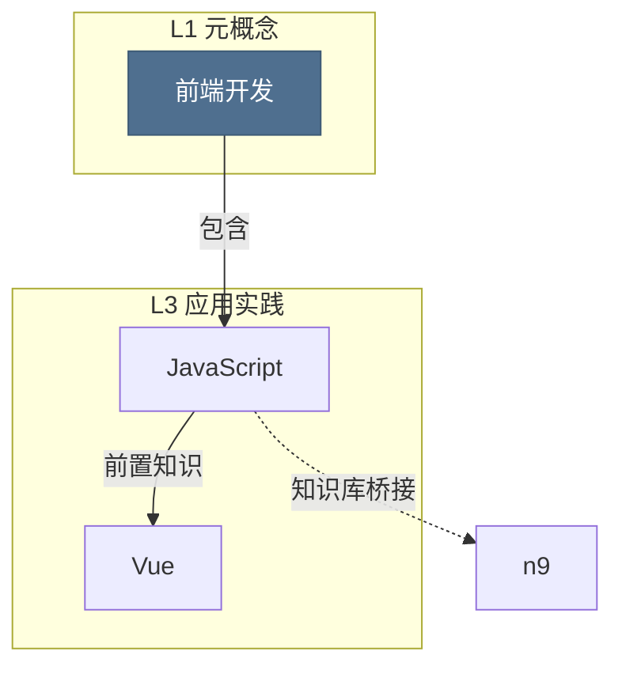

# 图谱总结与导出说明（Summary → Flowchart → AI → Doc/PPT）

> 解决的问题：图谱是**网**，人看久了会晕，大模型直接吃原始节点也吃不消。
> 本模块把网**收敛成流程**：先做结构总结，再生成 Mermaid 流程图（人看得懂、AI 读得懂），
> 最后可一键导出为 Markdown / Word / **PPT**。

---

## 一、四个产出一句话

| 产物 | 形式 | 给谁用 |
|---|---|---|
| 结构化总结 | JSON（层级/领域/枢纽/知识簇/学习主线/桥接/孤立/建议） | 前端展示、二次开发 |
| 总结流程图 | **Mermaid `flowchart TD`** 源码 | 人（图形化）＋ AI（原生可读） |
| AI 可读摘要 | 紧凑纯文本 digest（固定结构、token 友好） | 直接投喂大模型继续学习/出题/续写 |
| 文档与 PPT | `.md` / `.docx` / `.pptx` | 汇报、留档、讲课 |

---

## 二、结构总结算了什么（全部来自真实节点与连线，不臆造）

| 维度 | 算法 |
|---|---|
| 层级结构 | 按 `node.level` 分桶（L1 元概念 / L2 核心理论 / L3 应用实践 / L4 实现工具），每层按度数取代表 |
| 领域分布 | 按 `node.domain` 聚合，给出占比与平均层级 |
| 核心枢纽 | 度数 Top12（度 < 2 不计），附关系类型构成与「连到谁」 |
| 知识簇 | **并查集**求连通分量（≥2 个节点才算簇），标注主领域、涉及文件数、代表节点 |
| **学习主线** | 沿真实连线行走：起点取「层级靠前 + 入边少 + 度数高」，前进优先 `前置 → 理论 → 实现 → 延伸 → 演进 → 应用 → 对比 → 等价 → 桥接 → 弱关联`，不回访已走节点 |
| 知识库锚定 / 桥接 | 统计被知识库概念锚定的节点数；列出 `semantic_bridge` 连线及其证据 |
| 孤立知识点 | 度数为 0 的节点（知识缺口） |
| 结论与建议 | 规则触发：孤立点过多 / 层级缺骨架（无 L1）/ 枢纽过载 / 弱关联占比过高 / 领域未覆盖 / **标题疑似抽取噪音** |

> 最后一条特别有用：如果节点的标题像「一、基础概念辨析」「负责」这种，会被识别为
> 抽取噪音并给出提示 —— 这类节点会让总结与流程图的可用度打折扣。

---

## 三、流程图为什么「AI 能读」

Mermaid 是**纯文本的图形描述语言**，大模型对它的理解远好于一张 PNG：



要点：

- **按学习阶段分组**（`subgraph L1…L4`，`direction LR`），把网排成自上而下的流程；
  也可切换「按领域分组」。
- **箭头上的文字是真实关系类型**（前置知识/理论基础/实现关系/知识库桥接…），
  不是装饰 —— AI 能据此判断先学什么、谁支撑谁。
- **虚线＝知识库桥接**，代表跨文件、靠知识库推理建立的知识通路。
- 节点 id 用 `n{数据库id}`，标签做了转义，`classDef` 按层级配色。

配套的 **AI 摘要** 则是「图 → 文本」的另一半，结构固定、便于机器解析：

```
[KNOWLEDGE-GRAPH-SUMMARY v1]
## META
nodes=22 links=174 files=5 domains=5 clusters=1 isolated=0 kb_bridges=49
relations: 等价知识点=..., 知识库桥接=...
## STAGES / ## DOMAINS / ## LEARNING-FLOW / ## HUBS
## KB-CONCEPTS / ## TRIPLES（源 --关系--> 目标）/ ## GAPS / ## SUGGESTIONS
```

把流程图源码或这份摘要粘进 ChatGPT / Claude / 飞书 / Notion / VSCode，
就能让 AI 按图继续展开、出题、写讲义 —— 这就是「AI 根据流程图来学习」。

---

## 四、导出

| 格式 | 内容 |
|---|---|
| **Markdown** | 十节完整文档：总览表 / 层级 / 领域 / 学习主线（按步编号）/ 枢纽 / 知识簇 / 桥接 / 孤立 / 结论建议 / Mermaid 源码 |
| **Word (.docx)** | 同上，标题层级 + 表格 + 项目符号，中文字体微软雅黑 |
| **PPT (.pptx)** | 10 页 16:9：封面 / 总览指标卡 / 层级四列 / 领域条形 / 枢纽表 / 知识簇卡 / **总结流程图（原生形状+箭头绘制）** / 知识库桥接表 / 待补全与建议 / 把图交给 AI |
| Mermaid (.mmd) | 流程图源码 |
| AI 摘要 (.md) | 紧凑 digest |
| JSON | 结构化总结全量数据 |

> PPT 里的流程图页是用**形状与箭头原生画的**（不是截图），在任何机器上打开都不糊，
> 也能继续手工编辑。

---

## 五、API

前缀 `/api/summary`：

| 方法 | 路径 | 说明 |
|---|---|---|
| POST | `/build` | 生成总结：`{summary, mermaid, ai_digest}`（`group_by` = level \| domain，`max_paths` 控制主线条数） |
| GET | `/mermaid?group_by=` | 只取流程图源码 |
| GET | `/ai-digest` | 只取 AI 可读摘要 |
| GET | `/download?fmt=md\|docx\|pptx\|mermaid\|digest\|json&title=` | 导出文件（`title` 建议 URL 编码） |

---

## 六、使用方式

### 前端

顶部导航「**图谱总结**」→ 自动生成一次，然后：

- 左侧：总览卡片 → 学习主线（带关系箭头）→ 核心枢纽 → 知识簇 → 层级/领域 → 知识库桥接 → 孤立点与建议
- 右侧：**总结流程图**（Mermaid 渲染，可 75%/100%/130% 缩放）＋ 两个页签「流程图源码 (Mermaid)」「AI 可读摘要」，各自带复制 / 下载按钮
- 顶部：流程图分组（按学习阶段 / 按领域）、主线条数滑条、导出按钮组（Markdown / Word / PPT / Mermaid / AI 摘要 / JSON）

### 命令行

```bash
cd backend
py scripts/graph_summary.py                        # 打印概览与 AI 摘要
py scripts/graph_summary.py --ai                   # 只打印 AI 摘要（可重定向）
py scripts/graph_summary.py --mermaid              # 只打印 Mermaid 源码
py scripts/graph_summary.py --export md docx pptx  # 导出到 backend/exports/
py scripts/graph_summary.py --demo --export pptx   # 用演示语料搭临时库再导出（不动正式库）
```

示例产物见 `test_data/summary_examples/`（PPT / Word / Markdown / AI 摘要 / Mermaid）。

---

## 七、依赖

- 后端新增：`python-pptx==1.0.2`、`python-docx==1.2.0`（已写入 `backend/requirements.txt`）
- 前端新增：`mermaid`（**动态 import**，单独打包成 `mermaid.core-*.js`，不拖慢首屏）

安装：

```bash
cd backend && py -m pip install python-pptx python-docx
cd kg-vue3 && npm i mermaid
```

---

## 八、质量保障（总结好不好，取决于两个前提）

### 1) 节点标题要干净

解析器已针对两类"假知识点"做了拦截：

- **中文编号小节标题**（「一、基础概念辨析」「（2）实现」「3. Tools 工具模块」）→ 视为结构，不产出节点；
- **谓语片段**（「负责」「分为三类记忆」「增加重试」）→ 切不出术语就丢弃该行，宁缺毋滥；
- 标题兜底时先剥编号前缀（「八、高频面试问答」→「高频面试问答」）。

解析规则改进后，用下面命令把历史节点按新规则重建（会清掉该文件的旧节点，节点上的手工编辑会丢失）：

```bash
cd backend && py scripts/kb_build.py --reparse
```

### 2) 连线要有依据

学习主线只踩在 `score ≥ 0.45` 的强关联上，且：

- 等价/桥接/弱关联类关系需 `score ≥ 0.6` 才会被当作"下一步"；
- 默认不跨领域（只放行强前置/强理论关系），保证每条主线是**一个领域的骨架链**；
- 同名知识点不重复进同一条主线，主线之间重合度 > 50% 判为重复；
- 若全图低分弱关联占比 > 50%，总结的「结论与建议」会提示你去「知识库」页点**重建知识关联** ——
  那才是让关联由知识决定的开关。
